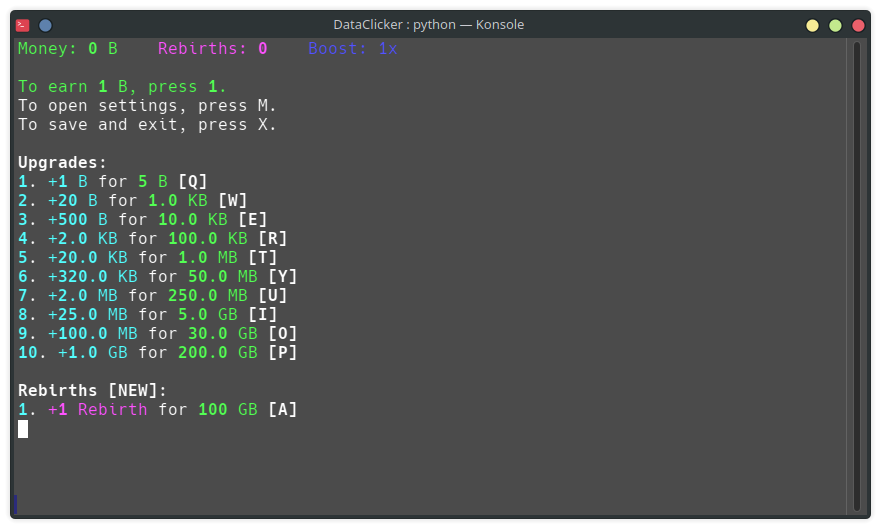

# DataClicker
DataClicker is a simple clicker game I originally made in C++ a year ago before porting it to Python.

> [!WARNING]
> **This game is only compatible with Linux systems, i might soon add support for Windows too.**

idk what else to type here so i'll go straight to the "setting up" part
## Setting up
1. Clone this repo, preferrably with the command `git clone` in the terminal.
2. Install the required Python libraries by typing this command into the terminal: `pip install -r requirements.txt`\
   **Make sure to enter that command while being in the DataClicker folder!**
3. Launch `DataClicker.py`

And that's it! Enjoy playing my game (somehow)
